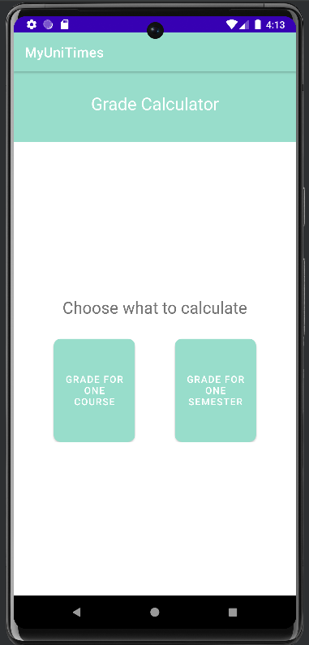
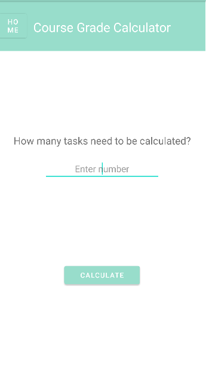
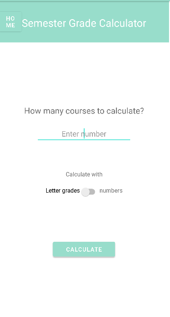

# Grade Calculator
*Grade Calculator for University of Calgary Students*
```Currently developing```



Author Information
------------------
- **Developer :** Dayee Lee
- **E-mail :** dy0318m@gmail.com

Project 
--------------------
An Android app that help users (students) to keep track of their grades and calculate their final result.  
One of the function that will be added to MyUniTimes later


Dev Environment
--------------------
1. OS 
    - ```Android``` 
  
2. API
   - ```27```
  
3. Language
   - ```Kotlin```
  
  
Features
--------------------

### 1. Calculate Course Grade
1. User input number of tasks to be calculated  
  
   

2. Get the number of tasks to calculate, and create the input boxes accordingly
3. User input grade that user got, full mark of each task, and weight of tasks
4. Result will be showed up at the bottom of the screen simultaneously

### 2. Calculate Semester Grade
1. User input number of courses that user took for the semester  
   
   
   
2. User toggle switch to input grade in letter grades or numbers
3. User input each course result
4. Result will be showed up at the bottom of the screen simultaneously
